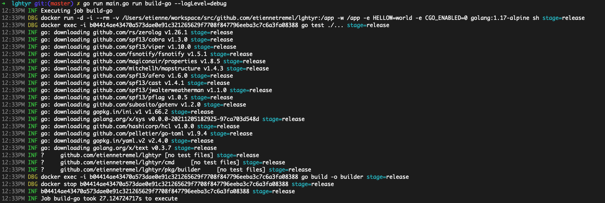

lghtyr
======

> Build CLI used to execute a CI pipeline based on a `builder.yaml` config
file.

## Overview

This small utility execute a list of commands in Docker defined in a
`builder.yaml`. When executed, the builder create a container with the provided
environment variables and mount the current directory into it. Then commands
are executed one after another.



## Getting started

Run it using Go, note that Docker CLI is required to be available on the host
machine before executing it.

```bash
$ go run main.go run build-go --help
Builder execute a pipeline based on a builder.yaml config file

Usage:
  builder [command]

Available Commands:
  completion  Generate the autocompletion script for the specified shell
  help        Help about any command
  run         Run job

Flags:
  -h, --help               help for builder
      --logFormat string   Log format: json or pretty (default "pretty")
      --logLevel string    Log level: trace, debug, info, warn,error, fatal or panic (default "info")

Use "builder [command] --help" for more information about a command.
```

Build itself using the `builder.yaml` located at the root of this repository:
```
$ go run main.go run build-go
```

## Config reference

```yaml
jobs:
  - name: <job name>
    stages:
      - name: <stage name>
        image: <Docker image to use>
        env: [<key>: <value>]
        commands: [<command to execute>]
```

## Example configuration

```yaml
jobs:
  - name: build-go
    stages:
      - name: release
        image: golang:1.17-alpine
        env:
          HELLOW: world
          CGO_ENABLED: 0
        commands:
          - go test ./...
          - go build -o builder
```
